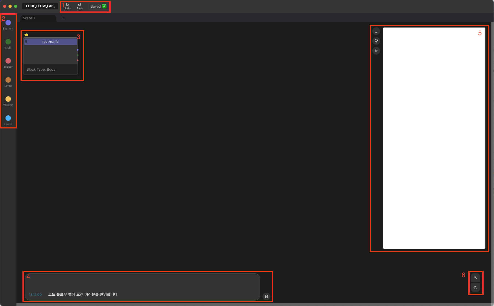
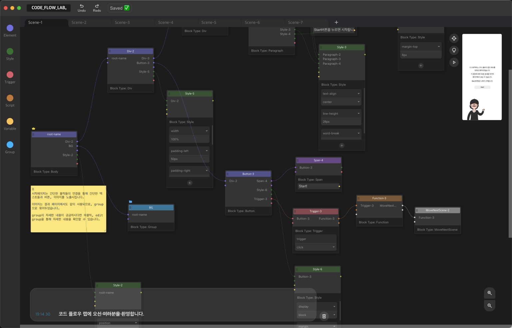

# code-flow-lab

코드 플로우 랩은 엘리먼트 노드를 연결하는 방식으로 프로젝트를 제작할 수 있도록 돕는 노코드툴이다.

- **시각화:** 각각의 엘리먼트들과 스타일, js까지 유기적으로 연결하여 각각의 연결관계를 직관적으로 살펴볼 수 있다.
- **편의성:** 코드 플로우 랩은 여러 블럭들을 조합하여 코드를 직접 작성해야 하는 번거로움을 덜어낼 수 있다.
- **내보내기:** 압축 파일로 내보내기 기능을 사용하면 작업한 결과물을 독립적으로 사용할 수 있다.

## 설치

간단히 깃을 클론하여 npm install, npm start를 하거나
[google_drive:code_flow_lab](https://drive.google.com/drive/folders/1AVpKCLHGPPlleuq_2ItLmz99VbMvwnXw?usp=drive_link)
링크로 접근하여 자신의 OS에 맞는 인스톨 파일을 다운로드 받아 구동한다.

## 시작하기

코드 플로우 랩의 화면은 다음과 같이 구성된다.

- **1:** 히스토리 관리 영역이다. 실행취소, 다시 실행을 할 수 있고, 저장 여부 또한 볼 수 있다.
- **2:** 각각의 블럭 리스트를 보거나 생성할 수 있다.
- **3:** 블럭을 연결하는 영역이다. 각 블럭은 연결점을 가질 수 있으며, 연결점마다 연결할 수 있는 블럭타입이 정해져있다. 연결 가능한 블럭타입은 연결점의 색상을 통하여 유추할 수 있다.
- **4:** 스크립트 블럭 중 console블럭을 통해 출력된 내용이 해당 영역에 표시된다.
- **5:** 3번의 연결된 블럭이 해당 영역에 표시한다. 왕관이 씌워진 블럭을 시작점으로 시작 블럭에 직간접적으로 연결된 블럭이 렌더링된다.
- **6:** 3번 영역을 확대하거나 축소할 수 있다.

보다 자세한 예시는 /example/example.cdfl을 실행하여 알 수 있다.

